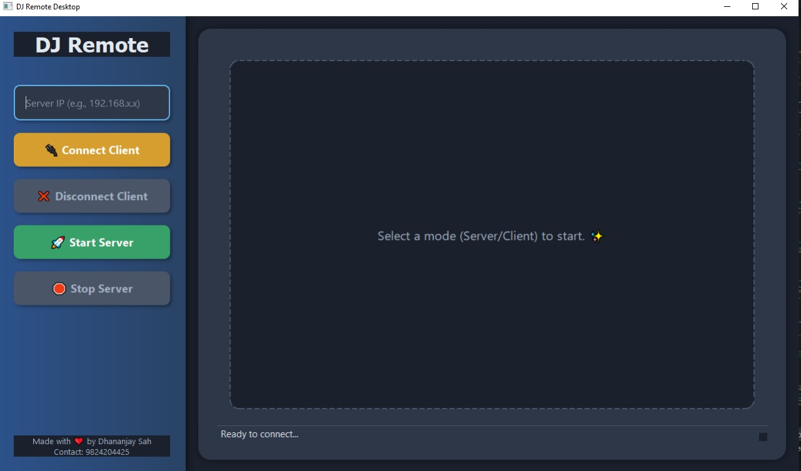
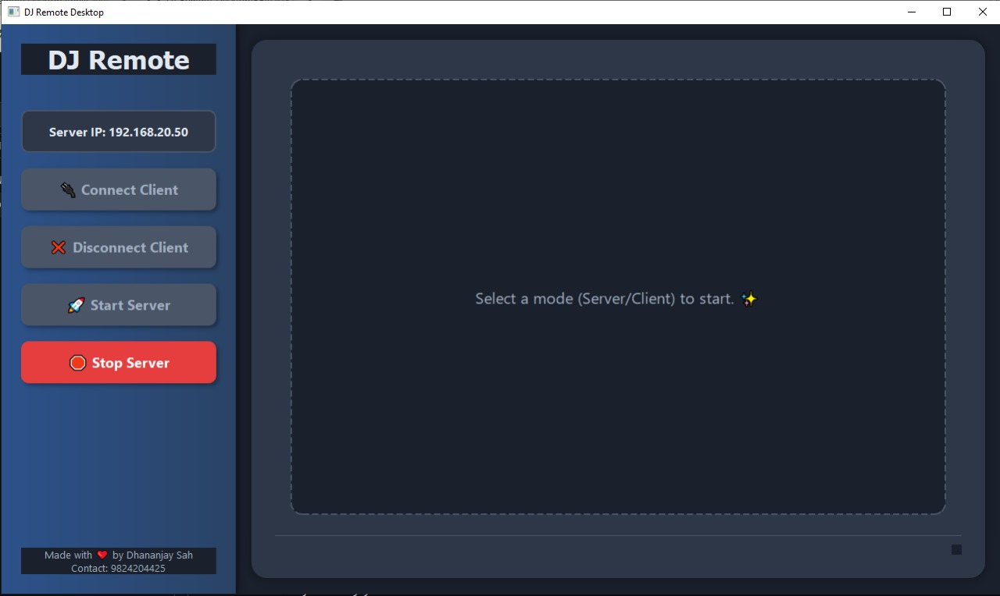

# DJ Remote Desktop

**DJ Remote Desktop** is a modern, open-source remote desktop application built with Python, PySide6, and OpenCV. It allows users to share their screen and control remote machines over a network with a sleek, user-friendly interface. The application supports both server and client modes, enabling seamless screen streaming and input control (mouse and keyboard) with adaptive image compression for optimized performance.

## Features

- **Server Mode**: Stream your screen to a connected client with adaptive JPEG compression to balance quality and bandwidth.
- **Client Mode**: Connect to a remote server to view and control its screen using mouse and keyboard inputs.
- **Modern UI**: Built with PySide6, featuring a polished interface with gradients, shadows, and smooth animations.
- **Cross-Platform**: Compatible with Windows, macOS, and Linux (requires a display environment for full functionality).
- **Responsive Input**: Supports mouse movements, clicks, scrolls, and keyboard inputs for a complete remote control experience.
- **Adaptive Streaming**: Dynamically adjusts JPEG quality based on frame size to optimize network performance.
- **Thread-Safe Operation**: Uses threading for non-blocking network operations and UI updates.
- **Error Handling**: Robust error handling with informative status messages for connection and streaming issues.

## Screenshots

### Server UI


### Client UI


*Note: Replace `screenshots/server_ui.png` and `screenshots/client_ui.png` with the actual paths to your screenshots after uploading them to your GitHub repository.*

## Prerequisites

- Python 3.8 or higher
- A display environment (for PyAutoGUI and PySide6 to work correctly)
- Required Python packages (listed in `requirements.txt`)

## Installation

1. **Clone the Repository**:
   ```bash
   git clone https://github.com/yourusername/dj-remote-desktop.git
   cd dj-remote-desktop
   ```

2. **Create a Virtual Environment** (recommended):
   ```bash
   python -m venv venv
   source venv/bin/activate  # On Windows: venv\Scripts\activate
   ```

3. **Install Dependencies**:
   ```bash
   pip install -r requirements.txt
   ```

   The `requirements.txt` should include:
   ```
   PySide6>=6.5.0
   opencv-python>=4.5.0
   pyautogui>=0.9.50
   numpy>=1.20.0
   ```

4. **Run the Application**:
   ```bash
   python dj_remote_desktop.py
   ```

## Usage

1. **Starting the Server**:
   - Launch the application.
   - Click the "🚀 Start Server" button.
   - Note the displayed **Server IP** (e.g., `192.168.x.x`) for client connections.
   - The server will listen for incoming connections on port `9999`.

2. **Connecting as a Client**:
   - Launch the application on another machine.
   - Enter the server's IP address in the "Server IP" input field.
   - Click the "🔌 Connect Client" button to start receiving the server's screen stream.
   - Use your mouse and keyboard to control the remote machine.

3. **Stopping the Session**:
   - Click "🛑 Stop Server" to stop the server.
   - Click "❌ Disconnect Client" to end the client session.

**Note**: Ensure port `9999` is open on the server machine and accessible through any firewalls.

## Controls

- **Mouse**: Move, click, drag, and scroll to control the remote desktop.
- **Keyboard**: Press and release keys to send input to the remote machine.
- **PyAutoGUI Failsafe**: Disabled for uninterrupted control. Be cautious, as moving the mouse to the top-left corner will not stop the application.

## Troubleshooting

- **Connection Refused**: Ensure the server is running and the IP/port are correct.
- **Headless Environment**: PyAutoGUI requires a display. Use a virtual display (e.g., Xvfb on Linux) if running on a headless server.
- **Port Conflicts**: Ensure no other application is using port `9999`.

## Contributing

Contributions are welcome! To contribute:

1. Fork the repository.
2. Create a new branch (`git checkout -b feature/your-feature`).
3. Make your changes and commit (`git commit -m "Add your feature"`).
4. Push to the branch (`git push origin feature/your-feature`).
5. Open a Pull Request.

Please ensure your code follows PEP 8 guidelines and includes appropriate comments.

## License

This project is licensed under the MIT License. See the [LICENSE](LICENSE) file for details.

## Contact

Created by Dhananjay Sah  
📧 Email: [your.email@example.com](mailto:your.email@example.com)  
📞 Phone: +977 9824204425  
🌐 GitHub: [yourusername](https://github.com/yourusername)

---

Made with ❤️ by Dhananjay Sah
